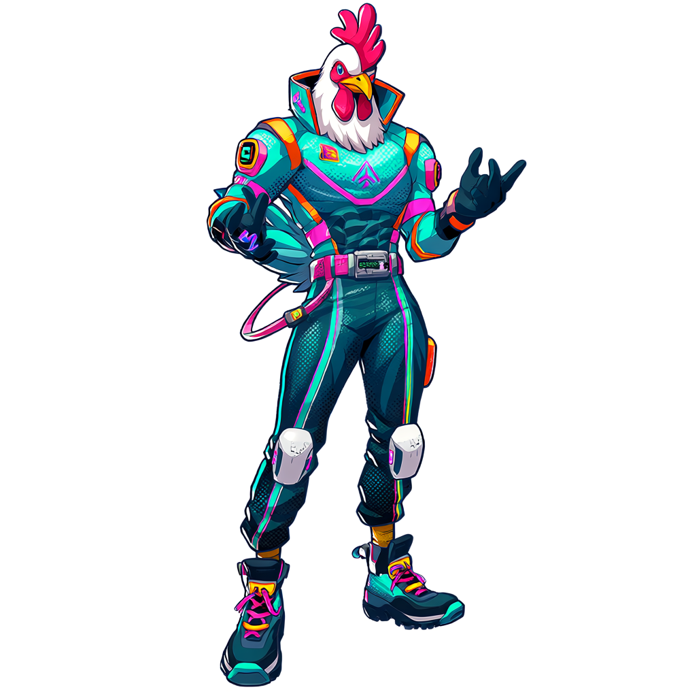
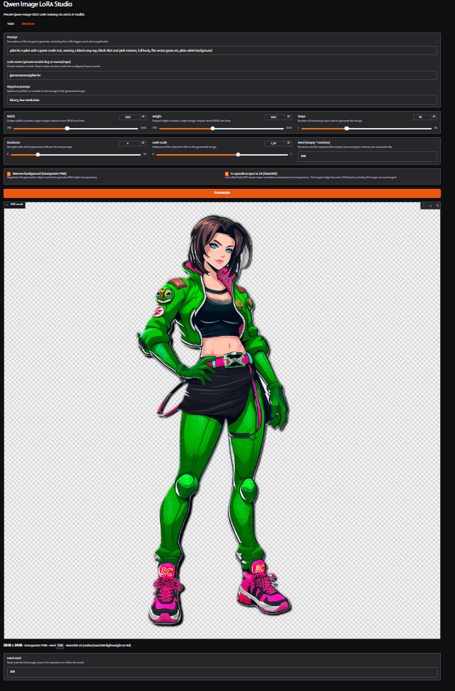

# Qwen Image LoRA Studio

Train private LoRA adapters on own art with open-weight, open-source Qwen-Image-2512.

Uses with [ostris/ai-toolkit](https://github.com/ostris/ai-toolkit), that has several receipts for moving to other models in a very easy way (in case new models come up eventually).

Exposes a UI using Gradio front-end but also runs a server endpoint that can be accessed via asynchronous SSE events at `POST /v1/generate`.

## Gallery

<table>
  <tr>
    <td width="50%" valign="top">
      
      <br><sub>A trained subject at 1024&times;1024, background kept.</sub>
    </td>
    <td width="50%" valign="top">
      
      <br><sub>A different prompt and LoRA at 1024&times;1024, background kept.</sub>
    </td>
  </tr>
  <tr>
    <td width="50%" valign="top">
      
      <br><sub>1024&times;1024 with background removal on &mdash; a genuine alpha PNG.</sub>
    </td>
    <td width="50%" valign="top">
      
      <br><sub>2048&times;2048: background removed, then Swin2SR &times;2 upscaled with transparency intact.</sub>
    </td>
  </tr>
</table>

## Train tab

Trains a LoRA on your own images with AI Toolkit and publishes it as a **private** model
repository. Three things are required before the button activates: a **job / LoRA name**, a
**trigger word**, and at least one image. Until all three are present the button stays disabled
and says which one is missing.

### Dataset and captions

Images are added with **Add training images** and held in a paginated gallery, 12 per page, with
a caption field under every thumbnail. Captions can also be uploaded in bulk with **Add caption
.txt files**; each file is matched to an image by filename stem, so `cammy.txt` fills in the
field for `cammy.png`.

<p align="center">
  
  <br><sub>A fully captioned ten-image dataset. Every caption begins with the <code>drone-bc</code> trigger word, and the status line above the gallery tracks how many images still need one.</sub>
</p>

The caption written next to each training image is resolved in this order:

1. The text typed into that image's gallery field, including anything a `.txt` upload put there.
2. A `.txt` file sitting beside the original image on disk.
3. The shared **Common style caption**.
4. The trigger word alone, if no caption exists anywhere.

The trigger word is then prepended unless the caption already contains it, so no image trains
without it.

Each uploaded image is EXIF-rotated, composited onto white, and written to the job's dataset
directory as `0000.png`, `0001.png`, ... with a matching `.txt` file. The compositing step
matters: converting an RGBA image straight to RGB only drops the alpha channel and leaves the
original background colour underneath, so cut-out PNGs would otherwise bleed their old
background back into the dataset.

### Job lifecycle

One job runs at a time; starting a second while one is active is rejected. A job moves through
`preparing images`, `queued`, `installing AI Toolkit`, `training`, `publishing`, and ends at
`published` or at `failed` with the error in the log.

Installation and trainer output stream into a fixed-height console that follows new output;
scroll up to pause auto-scrolling. Status and a bounded log (100,000 characters) are written to
`$SPACE_WORKDIR/jobs/<job-name>/` — `/tmp/qwen-image-lora-studio/jobs/<job-name>/` by default —
as `training.log` and `job.json`, and the most recent job name is recorded separately, so
refreshing Gradio reopens the latest job and keeps displaying its log. **Look up an existing
job** reopens any earlier job by name.

On success the newest `.safetensors` the run produced is uploaded as `adapter.safetensors`,
alongside the generated `training_config.yaml`, to a private repository named after the
slugified job name under the Space owner (`HF_SPACE_OWNER`).

### Advanced settings

Defaults follow the Qwen Image 24 GB AI Toolkit recipe: 1500 steps, rank 16, alpha 16, learning
rate 1e-4, `adamw8bit`, batch size 1, resolution buckets 512/768/1024, flow-match noise
scheduling, and a quantized transformer and text encoder with low-VRAM mode on. Only the UNet is
trained; the text encoder is not.

Collapsed accordions group the rest: **LoRA network** (rank, alpha, dropout), **Optimizer and
training**, **Dataset** (caption and token dropout, shuffling, repeats, crop, flip, buckets),
**Saving and samples** (checkpoint interval and retention, verification images), and **Model and
memory** (quantization type, accuracy-recovery adapter, low-VRAM mode).

The final **All AI Toolkit parameters** section accepts optional YAML that is deep-merged into
the generated `sd_trainer` process, exposing any setting the form does not surface:

```yaml
train:
  optimizer_params:
    weight_decay: 0.01
  noise_offset: 0.05
network:
  network_kwargs:
    only_if_contains: [attn]
```

The merge cannot redirect the values the Studio owns: process type, training folder, device,
trigger word, and the first dataset's folder path and caption extension are reapplied after it.

## Generate tab

Runs a prompt through the base model with an optional private LoRA. Short LoRA names resolve
under the Space owner; fully-qualified `owner/repo` IDs are used as given. The adapter is loaded
once and reused, so repeated generations with the same LoRA skip the load.

The controls are prompt, LoRA name, negative prompt, width and height (256-2048, default 1024),
steps (default 28), guidance (default 4), LoRA scale (0-2, default 1.25), and an optional seed —
leave it empty for a random one. The seed actually used is reported back, so a result can be
reproduced or refined.

Post-processing then runs in a fixed order:

```
generate  ->  remove background  ->  upscale
```

Background removal happens first so the upscaler receives the cut-out. The caption under the
result records the final dimensions, whether the PNG is genuinely transparent, which
segmentation model ran, the seed, and which upscaler was used.

### Background removal

**On by default.** Qwen Image produces opaque RGB art, so the subject is segmented with `rembg`
and the result is stored as a real alpha PNG rather than a white-matted one. The result viewer
draws a checkerboard behind the image so transparency is visible at a glance.

`rembg` is required to run on the GPU: it is driven through ONNX Runtime's CUDA execution
provider, and generation fails with an explicit error if `CUDAExecutionProvider` is not among
the available providers, rather than silently falling back to CPU.

Eight segmentation models are selectable, defaulting to `birefnet-general`. Each downloads once
on first use and its session is cached per model, so switching between them to compare results
does not re-download or re-initialize anything.

| Model | Notes |
| --- | --- |
| `birefnet-general` | Default. Segments at 1024px, which is what preserves thin details such as antennae, barrels, wings and hair. |
| `birefnet-general-lite` | Lighter, faster BiRefNet variant. |
| `isnet-anime` | Trained on illustration rather than photography; often wins on flat, cel-shaded art. |
| `birefnet-portrait` | Tuned for people. |
| `birefnet-massive` | Largest BiRefNet weights. |
| `isnet-general-use` | General-purpose IS-Net. |
| `bria-rmbg` | Non-commercial without a licence agreement with BRIA. |
| `u2net` | Fastest and lowest quality; segments at 320px. |

### Upscaling to 2K

**Off by default.** Enabling it runs Swin2SR (`caidas/swin2SR-lightweight-x2-64`) neural
super-resolution so the longest edge becomes 2048 pixels. An image already at 2K or larger is
returned unchanged.

The checkpoint is a native x2 model, so the image is first normalized to half the target size,
then super-resolved in 512-pixel tiles with 32 pixels of overlap. Tiling bounds VRAM use on
large images, and the overlap is cropped away as the tiles are reassembled so no seams appear.

Transparency is preserved rather than lost or upscaled as colour: Swin2SR runs on the RGB
channels only, while the alpha channel is resized separately with Lanczos and reattached
afterwards. A cut-out generation therefore stays a transparent PNG at 2048x2048.

If Swin2SR cannot download, initialize, or fit in the available VRAM, generation does not fail.
It falls back to a plain Lanczos resize, frees the CUDA cache, and reports the fallback both in
the result caption and in the API response's `upscale_warning`.

## Project files

| File | Contents |
| --- | --- |
| `app.py` | Entrypoint. Mounts `POST /v1/generate` on the Gradio app and launches it. Imports `ui` first so `spaces` (ZeroGPU) initializes before torch. |
| `ui.py` | Gradio layer: the Train and Generate tabs, their event handlers, and the layout. Builds `demo` at import time. |
| `style.css` | All custom CSS for the Space, read at import into `APP_CSS`. Keeps presentation out of the layout code. |
| `generation.py` | Inference: LoRA pipeline loading, the `GenerateRequest` model, rembg cutouts, and tiled Swin2SR upscaling. |
| `training.py` | Training: job registry, AI Toolkit bootstrap into its isolated venv, dataset and caption handling, upload to a private repo. |
| `requirements.txt` | Space dependencies. AI Toolkit's own pins live in the separate venv `training.py` creates. |
| `examples/` | Gallery screenshots used by this README. |

The dependency direction is one-way: `training` <- `generation` <- `ui` <- `app`. Training imports nothing from the other layers.

## Environment notes

The Space intentionally uses Python 3.11 because AI Toolkit currently pins SciPy 1.12, which does not provide Python 3.13 wheels.
AI Toolkit is cloned and installed into an isolated virtual environment so its pinned dependencies cannot modify the running Gradio application.
The toolkit environment also pins `kernels==0.12.3`, matching the API required by its Transformers 5.5.x dependency. For PyTorch 2.11 and newer it installs TorchAudio 2.11, which uses PyTorch's stable ABI; older PyTorch releases receive their matching TorchAudio build.

## Space secrets
No secret is required locally.

Set `HF_TOKEN` in **Settings → Variables and secrets** in Hugging Face. It must have write access to create and upload private model repositories under this account.

## API

`POST /v1/generate`

```json
{
  "prompt": "portrait photo of mysubject in a forest",
  "lora_name": "mysubject-v1",
  "negative_prompt": "blurry",
  "width": 1024,
  "height": 1024,
  "steps": 28,
  "guidance_scale": 4.0,
  "lora_scale": 1.25,
  "seed": 42,
  "scheduler": null,
  "base_model": null,
  "remove_background": true,
  "background_model": "birefnet-general",
  "upscale_to_2k": false
}
```

`background_model` accepts any of the eight models listed under [Background removal](#background-removal) and defaults to `birefnet-general`; an unknown name is rejected with a 400.

The response contains a PNG as base64 plus its dimensions, transparency status, upscaler details, used seed, and a replayable `generation_parameters` object. Reuse those parameter fields in the approved-final request so prompt, LoRA, negative prompt, steps, guidance, LoRA scale, seed, scheduler, and base model remain locked. The draft and final both generate at 1024×1024; only the final sets `upscale_to_2k: true`, producing 2048×2048. When `remove_background` is enabled, `rembg[gpu]` runs through ONNX Runtime's CUDA execution provider and returns a genuine alpha PNG. If Swin2SR cannot load or fit in memory, the response reports that it used the Lanczos fallback. LoRA names resolve under the Space owner (`HF_SPACE_OWNER`); fully-qualified private model IDs also work.

## Hardware

For training, 48 GB+ is recommended for Qwen Image 2512. A100 or similar GPU ($2.50 per hour at Hugging Face, but cheaper in Cloud Providers).

The first inference loads roughly 20B model parameters and can take several minutes.
